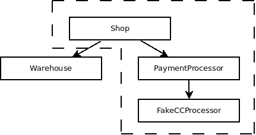

# Inline Configuration Units

Inline configuration units are needed when we need a static embedding of a
services, or when we need to refer to a concrete deployment of a service. So far
we have dealt with this issue by passing the configuration unit anonymously
directly where it is needed:

```jolie
embedded {
    JoliePackage:
        "my-service" in MyServicePort {
            myConfiguration = {
                .param = 42
            }
        }
}
```

For embedded Jolie packages we have for example allowed use of the `republish
as` keyword. However it appears that passing configuration units anonymously may
not be sufficient. Take for example the following case:



Say that we wish to propagate configuration from `FakeCCProcessor` all the way
to `Shop`. This is not possible with the anonymous configuration unit approach.
We would have to change the source code of the `PaymentProcessor` and make the
embedding of `FakeCCProcessor` static as opposed to configurable. If we instead
allow for named configuration units we can solve this problem. I propose that we
allow for configuration units to be part of the ordinary AST.
Implementation-wise we can probably get away, however, with keeping them
separate. Thus, in addition to anonymous configuration units we should be able
to do the following:

```jolie
//
// In the PaymentProcessor we can keep the FakeCCProcessor as externally
// configurable
//
ext outputPort FakeCCProcessor { /* ... */ }

//
// In the Shop we can republish directly to ourselves
//
outputPort PaymentProcessor { /* ... */ }

profile "embedded-fake-processor" configures "FakeCCProcessor" {
    inputPort FakeCCProcessor { Location: "local" }
    SOME_PARAM republish as PROPAGATED_PARAM
}

embedded {
    JoliePackage:
        // TODO What about a reference to a configuration unit here?
        "PaymentProcessor" in PaymentProcessor {
            inputPort PaymentProcessor { Location: "local" },
            outputPort FakeCCProcessor embeds "embedded-fake-processor",
            SOME_OTHER_PARAM republish as PROPAGATED_PARAM_OTHER
        }
}
```

Using externally-configured units here could make sense, but however also
introduce some potential problems. For example, we do not wish to have republish
in these external files.