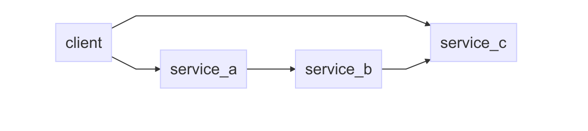

# Plugable Services

## Changelog

## Issues

Include statements are problematic. For example including `runtime.iol` multiple
times sometimes has issues.

Configuration is currently not shared amongst multiple services, thus we don't
have one global place of configuration. I propose something along the lines of
`jpm start <service>` for starting a service we depend on. As propsed
[here](../simple_calculator/client_external/README.md).

## Description

This example shows a slightly more advanced where our client will depend on
several services, which themselves also have dependencies. The exact case we're
working with is illustrated here:

Potential goals that we might want to achieve (some might not be possible, some
might be undesireable):

  1. It should be possible for the client to control how services are bound
  2. A client shouldn't need to know the entire dependency graph
  3. A system should allow for several instances of a service to co-exist
  4. A system should allow for several versions of the same service to co-exist
  5. A solution should require us to make as few decisions as possible

