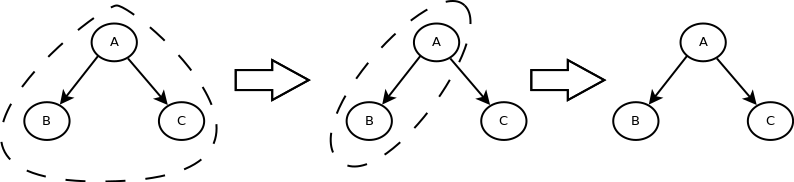
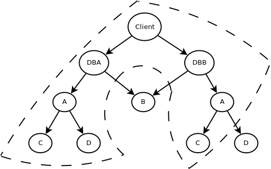
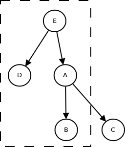

# Use Cases and Refinements

First we classify services by the following properties:

  - __open or closed:__ closed services contain only types and interfaces, open
    services additionally contain source code for running the service
  - __internal or external:__ internal services are embedded inside of a parent
    service, external services are hosted in another VM

|              |          __Open__         |      __Closed__      |
|--------------|---------------------------|----------------------|
| __Internal__ | An embedded Jolie service | Doesn't exist        |
| __External__ | A deployed Jolie service  | Any external service |

## Core Goals

  1. Provide configuration for a package
  2. Provide visibility into how the system works
  3. Allow for easy prototyping (For example by embedding dependencies as
     opposed to running them)
  4. Should work with all existing Jolie features

## Refinements

Let's start by discussing a few refinements that were made to the 
[previous proposal](../), most of these changes are merely refinements, but 
there are some changes.

The first refinement is that one package corresponds to exactly one service.
This means that when we're talking about deployment of a package we're
essentially talking about deployment of a single service. This also means that
we can refer to embedding a package by its package name, since the document
defining the package contains a reference to the main file.

A large part of this configuration problem comes down to deployment. The way I
currently envision deployment of a package is as follows:

  1. Tell the server to pull a certain package and "install it" (e.g. 
     `jpm install <package>`)
  2. Deploy with a given configuration (e.g `jpm deploy <config>`)

Thus in order to deploy an entire system we're going to end up with many
different configuration units.

A single configuration unit contains information _only_ for the package that is
being deployed. It will contain _no_ configuration for dependencies, even if
those are being embedded in the package. We identify a configuration unit by a
unique identifier.

The configuration unit itself contains:

  - An associated package
  - A set of constants
  - A set of partial input ports
  - A set of partial output ports

The partial input and output ports are made complete by their in-source
counterpart.

A package may provide a single default configuration unit. Thus unit does not
have to be complete (i.e. provide configuration for all external constructs).
The default unit will be merged with any configuration unit which provides
configuration for that package. The default will only provide any values if the
main unit doesn't override them. The default unit will be found at the package
root in a file called `default_config.<ext>`.

## Cases

### Easy Prototyping



(The dashed region corresponds to which services that are embedded together)

This use-case is intended to show how we can easily go from a prototype where we
embed everything (this is easier to run locally) to hosting each service by
itself.

```jolie
// A.ol

ext outputPort A {
    Interfaces: AIface
}

ext outputPutPort B {
    Interfaces: BIface
}

constants {
    FOO: int
}
```

```jolie
// A.col

include "B.col" // The includes work just like they do in Jolie
include "C.col"

// Previously called namespace. Configures makes it more explicit that we're 
// talking about a specific package and not an arbitrary name 
configures "A" { 
    // Like always we just put the definitions here
    FOO = 42

    // We alter the syntax slightly for output ports being embedded
    outputPort B embeds B 
    // The second B refers to the profile B (if no profile is specified it gets 
    // the same name as the package it configures). This means that this 
    // configures block also has name "A". It could also have been written as:
    // `profile "A" configures "A"`

    outputPort C embeds C
}
```

__Note:__ The previous proposal did not allow for embedding of services directly
from the configuration. This is however needed since packages by themselves
should be considered read-only. Thus if we want to configure a package to embed
its dependencies, then this must be done from external configuration, we cannot
do this in source.

```jolie
// B.col

configures "B" {
    inputPort B {
        Location: "local"
    }
}
```

```jolie
// C.col

configures "C" {
    inputPort C {
        Location: "local"
    }
}
```

In order to use an external B we need to update "A.col":

```jolie
// A.col
include "C.col"

configures "A" {
    outputPort B {
        Location: "socket://b.example.org:8000"
        Protocol: sodep
    }
    outputPort C embeds C
}
```

In order to update the deployment file of B we simply need to update the 
input port to no longer be local.

```jolie
// B.col
configures "B" {
    inputPort B {
        Location: "socket://localhost:8000"
        Protocol: sodep
    }
}
```

In most cases however this would be unnecessary since the default 
configuration file for "B" could already include a default input port.

In that case we could simply deploy directly from the default configuration. The
restriction on configuration units to only configure a single package helps a
lot. This restriction means that we cannot from any node configure any other
node which isn't a direct child of it. Without this we wouldn't be able to
easily swap out one configuration unit for another.

### Duplicate Embedded Packages with Shared External Services



(Again dashed region marks the services embedded together)

In this example we have a client which embeds two instances of the same service.
Those being `DBA` and `DBB`, these have a package name of `database` (although
we will just use it as a generic service). These two instances share a single
service `B`, but other than that they have their own embedded instances.

```jolie
// Client.ol
ext outputPort DBA {
    Interfaces: DatabaseIface
}

ext outputPort DBB {
    Interfaces: DatabaseIface
}
```

```
// Database.ol
ext inputPort Database {}
ext outputPort A {}
ext outputPort B {}
```

Both the client and the database has two external output ports each.

```
// Client.col
include "DBA.col"
include "DBB.col"

configures "Client" {
    outputPort DBA embeds DBA
    outputPort DBB embeds DBB
}
```

Just like before we can easily embed `DBA` and `DBB` given their configuration
units: 

```
// DBA.col
include "DBA_A.col"

profile "DBA" configures "Database" {
    inputPort Database {
        Location: "local"
    }

    outputPort A emebds DBA_A

    outputPort B {
        Location: "socket://shared.example.org:41000"
        Protocol: sodep
    }
}
```

```
// DBB.col
include "DBB_A.col"

profile "DBB" configures "Database" {
    inputPort Database {
        Location: "local"
    }

    outputPort A embeds DBB_A

    outputPort B {
        Location: "socket://shared.example.org:41000"
        Protocol: sodep
    }
}

```

We set the output port `B` which they share to the same location. We also let
`A` point to two different embeddings. That way we ensure that they can get
different configurations.

```
// DBA_A.col
include "C.col"
include "D.col"

profile "DBA_A" configures "A" {
    inputPort A {
        Location: "local"
    }

    outputPort C embeds C
    outputPort D embeds D
}
```

```
// C.col
profile "C" configures "C" { // Can also be written as just: configures "C"
    inputPort C {
        Location: "local"
    }
}
```

```
// D.col
configures "D" {
    // We might want a short hand for embedding with something like this
    // But for this we need to know which input port that needs to be changed.
    inputPort D {
        Location: "local"
    }
}
```

```
// DBB_A.col
include "C.col"

profile "DBB_A" configures "A" {
    inputPort A {
        Location: "local"
    }

    // We can share the configuration unit since they are the same
    outputPort C embeds C 

    outputPort D {
        // Something external
    }
}
```

Note that even though `DBA_A.col` and `DBB_A.col` share the same configuration
for `C` doesn't mean they use a shared instance. They are simply passed
identical configuration units.

Also note how easy it would be to externally host a single unit. If for example
we would like to host the `A` dependency of `DBB`, while still embedding `C`. We
would simply change the input port in `DBB_A.col` and change the output port to
`A` in `DBB.col`. Anything else would remain the same, largely due to the fact
that each configuration unit only takes care of themselves.

### Package with Statically Embedded Services



However one problem with each configuration unit defining the package itself,
and not dependencies is that we no longer can configure children further down in
the tree, even if their embedding is fixed in the source code. For example `E`
in this case might depend on the configuration of `B`.

We will introduce configuration sections for embeddings. These work mostly like
the external configuration files, except that these sections also allow for
republishing of configuration. This way we may push configuration further up in
the tree, but we will only allow this if the embedding is fixed in source.

```
// A.ol

ext inputPort A {}

constants {
    A_CONSTANT: int,
    B_CONSTANT: int
}

ext outputPort C { /* ... */ }

outputPort B { // Since B is being embedded in-source it cannot be "ext"
    Interfaces: BIface
}

embedded {
    Jolie:
        "b.ol" in B {
            // This is essentially republishing the same configuration that 
            // B exposes. The syntax is: 
            // <construct in embeddee> republish as <construct in embedder>
            B_CONSTANT republish as B_CONSTANT

            inputPort B {
                Location: "local"
            }
        }
}
```

```
// D.ol

ext inputPort D {}

constants {
    D_CONSTANT: int
}
```

```
// E.ol
ext outputPort C
outputPort A {}
outputPort D {}

embedded {
    Jolie:
        "a.ol" in A {
            // This allows us to provide a complete configuration unit, in the 
            // almost same syntax as the external files (we don't need the 
            // wrapper since we're just passing the contents). The syntax won't 
            // be the exact same since external files can't republish
            inputPort A {
                Location: "local"
            }

            A_CONSTANT = 42
            B_CONSTANT = 300

            outputPort C republish as C
        },
        "d.ol" in D {
            inputPort D {
                Location: "local"
            }

            D_CONSTANT = 1000
        }
}
```

Also note if `E` were to be embedded itself, then the only configuration it may
change is the external port `C` which is republished. This way `E` can make
assumption about how the children are configured. This is done by only
republishing the constants that should allow overriding and fixing the constants
that shouldn't. 