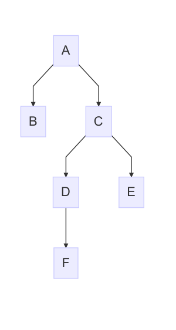

# Example 1



In this example we're programming a new service named "A". As we can see in the
figure the dependency tree is rather complex for "A". Assume the following:

  - "A"
    + Cares only about "B" and "C"
    + "B" is external and provided by "A"
    + "C" is released as a complete package and is embedded
    + Will complete the configuration of "C" (In turn completing "D", "E", and
      "F")
  - "B"
    + External output port (provided by "A")
  - "C"
    + Provides partial configuration for "D", "E", and "F"
    + Ideally we would have that some of this configuration could be made
      constant by "C" while other just being default. Let's just do this using a
      similar mechanism as in souce code? Marking some as default (allowing us
      to override) otherwise give an error if we attempt to override.
  - "D"
    + Provides no configuration for "F"
    + Will eventually be embedded inside of "C"
  - "E"
    + Has a fixed output port (not marked as ext)
  - "F"
    + Will eventually be embedded inside of "D"

## Interfaces and Ports

__B:__

```jolie
interface BIface {
    call(int)(int)
}

inputPort B {
    Location: ext
    Protocol: sodep
    Interfaces: BIface
}
```

__C:__

```jolie
interface CIface {
    call(int)(int)
}

inputPort C {
    Location: ext
    Protocol: ext
    Interfaces: CIface
}
```

__D:__

```jolie
interface DIface {
    call(int)(int)
}

constants {
    ext username: string,
    ext password: string,
    ext configuration: string
}

inputPort D {
    Location: ext
    Protocol: ext
    Interfaces: DIface
}
```

__E:__

```jolie
interface EIface {
    call(int)(int)
}

// Output port, __not__ input. Package contains no source code
outputPort E {
    Location: "socket://e.example.org:41234"
    Protocol: sodep
    Interfaces: EIface
}
```

__F:__

```jolie
interface FIface {
    call(int)(int)
}

inputPort F {
    Location: ext
    Protocol: sodep
    Interfaces: FIface
}
```
