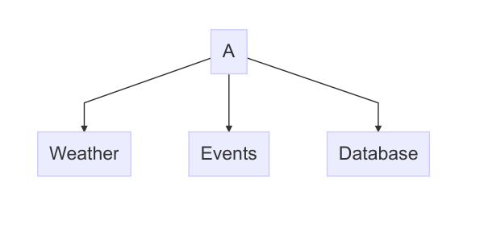

# Basics



This example is intended to show-case a simple and flat dependency tree. In this
example we have some fictional client, which aggregates upcoming events and
weather information from two external services, these are not hosted by us. This
is then inserted using some database service, which we host ourselves.

## Weather Package (Closed, external, w/no configuration)

The weather service we will be contacting will entirely external, and we do not
know the source code of it. We know that the weather service can be contacted
at:

```jolie
outputPort WeatherService {
    Location: "socket://weather.example.org:51234"
    Protocol: http
}
```

No additional configuration is required for these types of packages, and the
weather service should remain fixed.

## Events Package (Closed, external, w/configuration)

Like the weather package this service will be external, and the package will
contain no source code. This package also contains a single fixed output port:

```jolie
outputPort EventsService {
    Location: "socket://events.example.org:42000"
    Protocol: sodep
}
```

This package however requires some kind of configuration in the form of an API
key. This API key must be included in every request, such that the external
service may track our usage. For example:

```jolie
type EventRequest: void {
    .apiKey: string
    .eventType: string
    // ...
}

interface EventIface {
    RequestResponse:
        getEvents(EventRequest)(EventResponse)
}
```

### Problems

In this case we reach a minor problem. It is clear that the API key is static
for the entire session, however we cannot pass the API key as a constant, since
it must be added to every request.

__Solution 1:__ Just add the API key to every request, this requires more code,
but it is doable. This however feels like the configuration system not being
strong enough.

__Solution 2:__ Create a new service which clients consumes. This service would
also be embedded and would be responsible of taking the API key from
configuration, and then adding the key to every request. This way the "events"
service could have the following:

```jolie
constants {
    API_KEY: string
}
```

In the configuration of our client (A) we could have:

```jolie
API_KEY = "dG90YWxseSBzZWNyZXQgYXBpIGtleQ=="
```

And by simply using the fixed (and embedded) outputPort `EventService` it can
make requests without having to think about the API key.

I'm not sure how well the language handles such a case. But it sounds like
something that should be possible, or at the very least easy to generate.

Also note that for HTTP protocols this might not even be a problem, since
certain APIs allow us to pass the key through the header, which in this case is
bound to the output port and can take configuration from external constants.

## Database Package (Open, external, w/configuration)

This package will contain not only the interface and types (like the two
previous), but also contain the source code for actually running the service.
The package requires a username and a password. These are configured using
external constants, thus the source code of the database package contains:

```jolie
constants {
    USERNAME: string,
    PASSWORD: string
}
```

The package (let's call it `database`) is included in the 
[package document](/package_spec). From the root of the A package we may run:

```bash
jolie --service-name database --start-package database
```

which will start the database service pulling the configuration (which is placed
in the directory of A) in the "database" region. Thus we could write the
following configuration:

```jolie
region database {
    USERNAME = "foo"
    PASSWORD = "bar"

    inputPort Database {
        Location: "socket://localhost:13000"
        Protocol: sodep
    }
}
```

It might seem a bit misplaced that configuration goes in A and not in database.
This is however needed since the `database` package should be considered read-
only. Because of this we cannot place any configuration inside of the package,
and the only way to launch it should be using the `--start-package` command line
argument (as shown above).