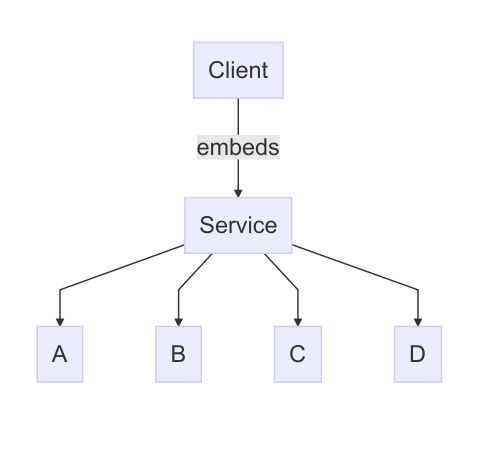

# Default Configuration


In this case we will continue to look at the database service as used in the
previous two examples. In this case we will introduce yet another constant
called `ALGORITHM`. This constant might control how some part of the database
actually works. This brings us to the next concept that I feel might be useful
namely default values for external constructs.

In `database.ol` the constant is marked as external: 

```jolie
constants {
    ALGORITHM: string
}
```

The database package itself has accompanying configuration. Here it may write:

```jolie
ALGORITHM = "default_algorithm"
```

Package A may then decide if it wishes to use the defaults provided by the
database package. If it is okay with the defaults it won't have to do anything
(apart from defining `USERNAME` and `PASSWORD`, we will provide an error if no
values are given at all). If A however wishes to provide a different algorithm
it may override the value by providing a new value:

```jolie
region database {
    ALGORITHM = "fancy_algorithm"
}
```

TODO how will the merging procedure work? It seems like we need to attach
ownership to these regions, such that the `ALGORITHM` constant only goes into
the regions that are associated with that package. We can't just give static
region names since we might have several regions for the same package. Also
namespaces??? Actually we might just throw these into every region and then
resolve it using namespaces.

# Partial and Final Configurations

Consider now the following diagram:



In this case we have a complicated service S which is embedded by a client which
we're writing. The dependencies of S (A through D) might be complicated and have
a lot of configuration. Here S might be able to provide sane defaults, which
makes it less complicated for a client to rely on S. This is nice since any
client using S shouldn't have to worry about the entire implementation of S.

This means that S may provide this partial configuration, just like we did in
the previous section. However in some cases S may need to make assumptions about
how its dependencies are configured. In this case S should be able to state that
the configuration cannot be overriden. This could for example be done using a
`final` modifier inside of the configuration. For example S might provide the
following configuration:

```jolie
region a {
    SOME_CONSTANT = 42
    final ALGORITHM = "fancy"

    outputPort Foo {
        Location: "socket://example.org:30000"
        Protocol: sodep
    }

    final outputPort Bar {
        Location: "socket://bar.example.org:40000"
        Protocol: http
    }
}
```

This means that the output port `Foo` and the constant `SOME_CONSTANT` can be
overriden by our client. Similarly if the client attempts to override `Bar` or
`ALGORITHM` an error will be thrown.

__Note:__ Adding modifiers to the configuration format might seem like a simple
decision to make, however doing this we make it more and more complicated to
also support additional formats.
