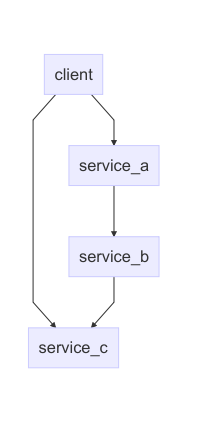

# Flat Files

We should be able to avoid name-clashes if we put every tarball into their own
directory. However this proves problematic due to the fact that inlcudes are
done relative to the current working directory, as opposed to in C++ where
includes are done relative to the file which has the include.

This becomes a problem since all includes would have to be changed if we extract
a package into a new folder, which exists in a different place, to where you
would start the interpreter.

Consider a package, which has the following dependency tree:

This should cause the following directory structure:

  - `include`
  - `lib`
  - `client.ol`
  - `jpm_packages`
    + `service_a`
      - `include`
        + `default_port.iol`
      - `lib`
      - `service_a.ol`
    + `service_b`
      - `include`
        + `default_port.iol`
      - `lib`
      - `service_b.ol`
    + `service_c`
      - `include`
        + `default_port.iol`
      - `lib`
      - `service_c.ol`

How a client include services `a` and `b` is a bigger question all-together.
Following are some options on how we can do this:

