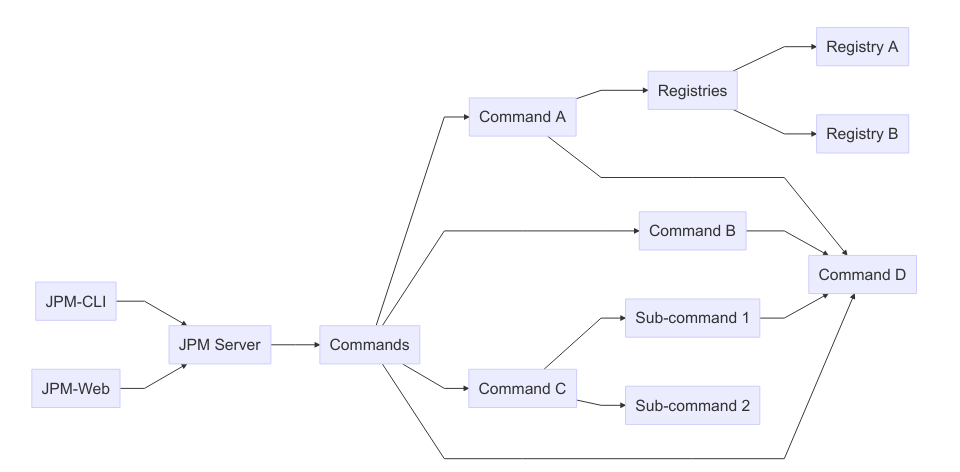

# Architecture

## Clients

The clients are responsible for providing a user-interface to the operations
provided by the package manager.

The package manager being a server, which depending on the client might be
internal or external. For example in the case of the CLI it makes more sense to
embed it, as to avoid having to launch the server.

## The JPM Server

The JPM server provides the main operations for the package manager. This
includes operations such as reading a package description or installing
dependencies into a package.

## JPM Registries

The JPM server will contact one or more registries. These registries contain the
actual registries. They will provide operations such as:

  - List all packages
  - List versions of a package
  - Provide an endpoint for downloading packages

By default JPM will provide a default package registry. This package registry
will be known as "public". This is intended to be the default location for
packages which should be shared with the public. JPM will support multiple
package registries to allow for organizations to host their own internal
registries.

__TODO:__

  - Several more operations could be needed. For example an organization might
    want to mirror a number of public packages. Such that all packages can be
    provided by their registry. This way they can ensure that no unvetted
    package is used.
  - Several more security features would most likely also make sense. For
    example ensuring integrity of a package.
  - A local registry could be used as a cache?
  - Authentication?
  - Rules for publishing packages?

## Commands

### Sub-Commands

